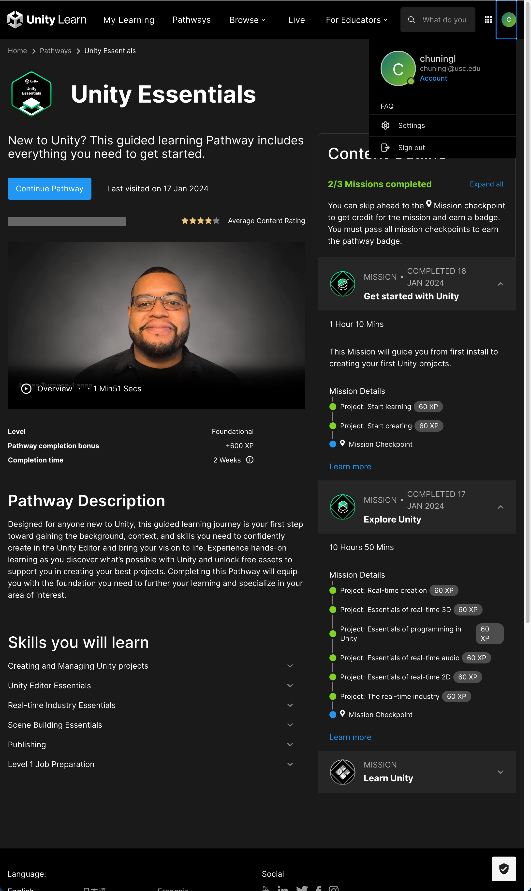
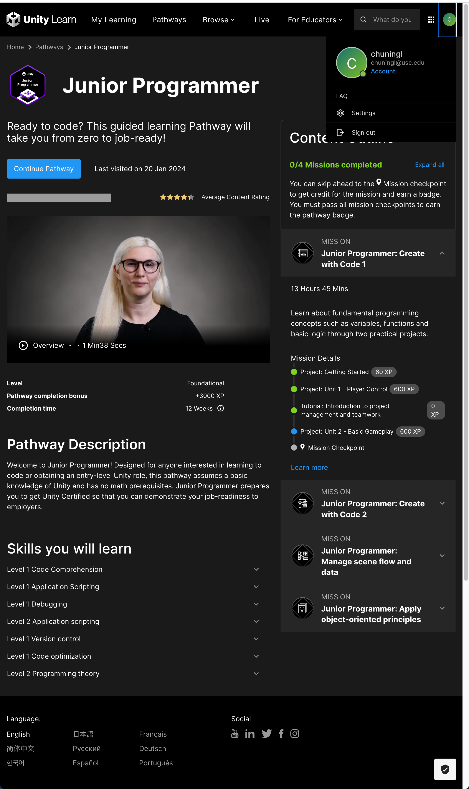
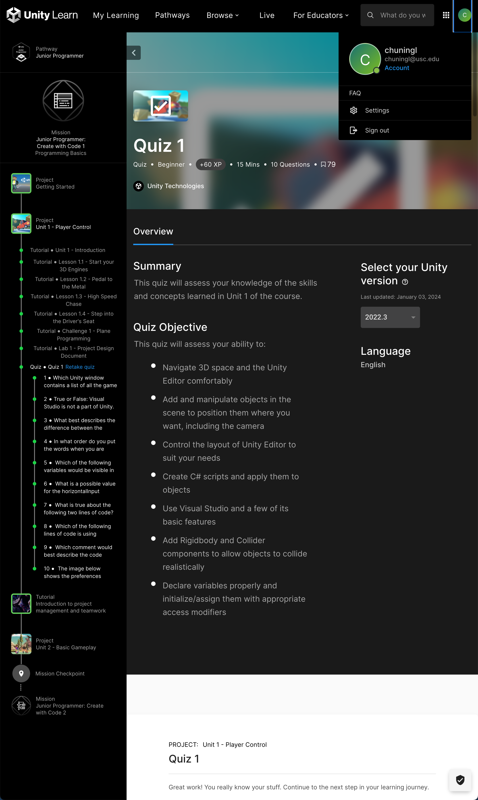

# CSCI526_Assignment1

# Unity Essentials  
## Complete tutorial missions:  

## Mircogame: 
[mircogame](https://play.unity.com/mg/lego/webgl-builds-386409)

## Essentials of Real-Time 3D && Essentials of programming
[Essentials of Real-Time 3D](https://play.unity.com/mg/other/webgl-builds-386730)

### Script
[BallTransform](.../../Script/EssentialsofProgramm/BallTransform.cs)  
[Rotate](.../../Script/EssentialsofProgramm/Rotate.cs)  
[TrackPosition](.../../Script/EssentialsofProgramm/TrackPositon.cs)  

## Essentials of real-time 2d:  
[Essentials of real-time 2d](https://play.unity.com/mg/other/webgl-builds-386773)
### Script
[Hat_Collection](.../../Script/EssentialsofReal2D/hat_Collection.cs)

# Unity Junior Programming pathway
## Getting Started: 

## Car prototype:  
[Car prototype](https://play.unity.com/mg/other/webgl-builds-386885)
### Script
[FollowPlayer](.../../Script/CarPro/FollowPlayer.cs)  
[PlayerController](.../../Script/CarPro/PlayerController.cs)
## Plane Protopyte:
[Plane Protopyte](https://play.unity.com/mg/other/webgl-builds-386893)
### Script
[FollowPlayerX](.../../Script/PlanePro/FollowPlayerX.cs)  
[PlayerControllerX](.../../Script/PlanePro/PlayerControllerX.cs)  
[Propeller](.../../Script/PlanePro/Propeller.cs)  
## Design document:
[Design docume](https://docs.google.com/document/d/1OAewa218eECkvg6QKjVTd7eJnCNsQf_YiAVadi0kWVM/edit?usp=sharing)

## Lessons and quiz:

## Introduction to projec Management and Team work: 
[Project design document](https://docs.google.com/document/d/1ofSNWMWcVUmg7IImCSi-BNXaf8JRE7HvlO7IerUKsls/edit?usp=sharing)

[Project Charter](https://docs.google.com/document/d/11-aAq4JgHPQPH0I_6wD5SS3bwe5kzuhkJx_ltj6cMEk/edit?usp=sharing)